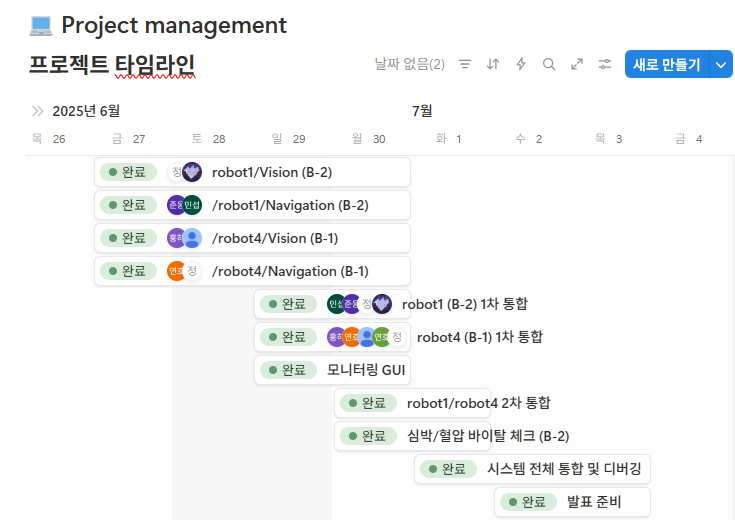
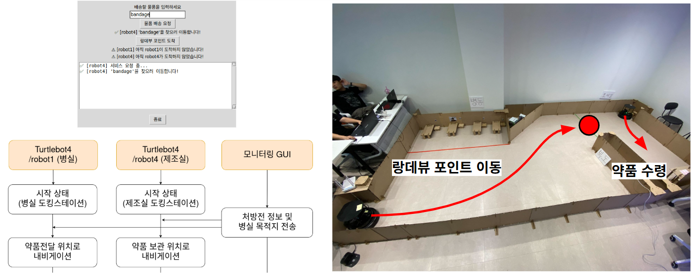
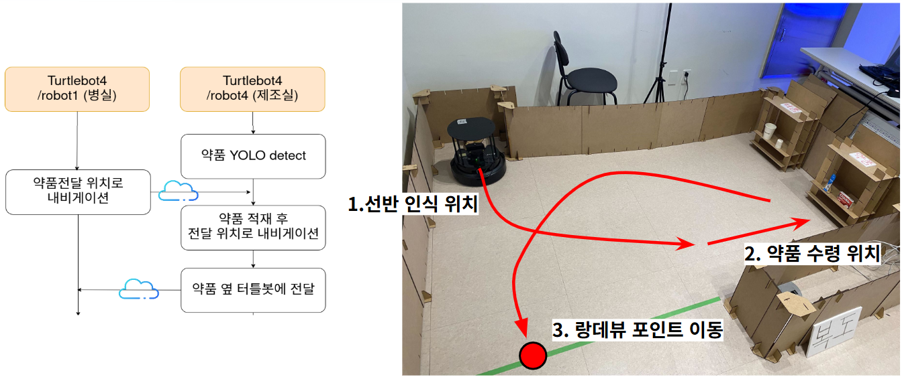
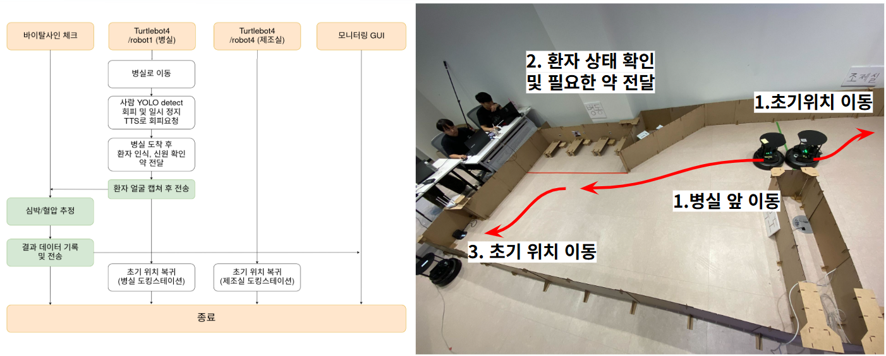

💉 ARM 기반 간호 어시스턴트 로봇
===
ROKEY B-1,2조 지능-1 Project (SLAM(위치추정 및 공간지도생성)기반 자율주행 로봇 시스템 구현)
---

### 🔨 개발환경
본 프로젝트는 Ubuntu 22.04 (ROS2 humble) 환경에서 개발되었습니다.   
&nbsp;

### 🦾 작업공간
</img>   
&nbsp;

### 💻 코드 실행

#### **main controller node**
code: [main_controller.py](rokey_pjt_turtle4/rokey_pjt/rokey_pjt/main_controller.py)
```bash
ros2 run rokey_pjt main_controller
```

#### **vision node**
code: [robot4_vision.py](rokey_pjt_turtle4/rokey_pjt/rokey_pjt/robot4_vision.py)
```bash
ros2 launch rokey_pjt robot4_vision.launch.py
```

#### **navigation node**
code: [robot4_navigation.py](rokey_pjt_turtle4/rokey_pjt/rokey_pjt/robot4_navigation.py)
```bash
ros2 run rokey_pjt robot4_navigation
```

### 아래 런치 파일로 모든 노드 실행
#### **launch**
code: [robot4.launch.py](rokey_pjt_turtle4/rokey_pjt/launch/robot4.launch.py)
```bash
ros2 launch rokey_pjt robot4.launch.py
```
&nbsp;

### 📷 시연 영상
https://youtu.be/nDBsC1EKSE8

---
&nbsp;

## 목차

[1. 📘 프로젝트 개요](#1.-📘-프로젝트-개요)   

&nbsp;

## 1. 📘 프로젝트 개요
본 프로젝트는 **Turtlebot4**과 ROS 2 Humble를 활용하여 병원 내 간호사의 반복적 업무 부담을 줄이기 위해, 약품 전달과 환자 생체징후 확인을 지원하는 로봇을 개발하는 팀 프로젝트입니다.  

&nbsp;

## 2. 👥 프로젝트 팀 구성 및 역할분담
| 이름 | 역할 |
|------|------|
| 백홍하(팀장) | /robot4/Vision, Main Controller GUI, ROS 통신 |
| 이하빈 | /robot4/Vision, ROS 통신 |
| 장연호 | /robot4/Navigation, EMQX Cloud 통신 |
| 정찬원 | /robot4/Navigation, 영상 편집 |
| 이경민 | /robot1/Vision |
| 최정호 | /robot1/Vision |
| 문준웅 | /robot1/Navigation, Main Controller GUI |
| 정민섭 | /robot1/Navigation, 바이탈 체크 기능 개발 |

&nbsp;

## 3. 🗓 프로젝트 구현 일정
**진행 일자: 25.6.27(금) ~ 25.7.3(목) (7일)**
</img>

&nbsp;

## 4. 📌 SKILLS
</img>   

&nbsp;

## 5. ⚒️ System Architecture
</img>

&nbsp;

## 6. 🛠️ Node Architecture
</img>

&nbsp;

## 7. 🎬 System Flow
</img>

&nbsp;

- **프로젝트 시나리오**   
</img>
</img>
</img>

&nbsp;


## 8. 🔍 프로젝트 기대효과

### **기대 효과**
- 자율주행 로봇 + 네트워크 자원 최적화 통해 안정적 시스템 구현
- 클라우드 기반 구조로 병원 규모 확장 시에도 유연하게 대응 가능
- 반복 업무 자동화로 간호사는 전문 업무에 집중 가능

&nbsp;
